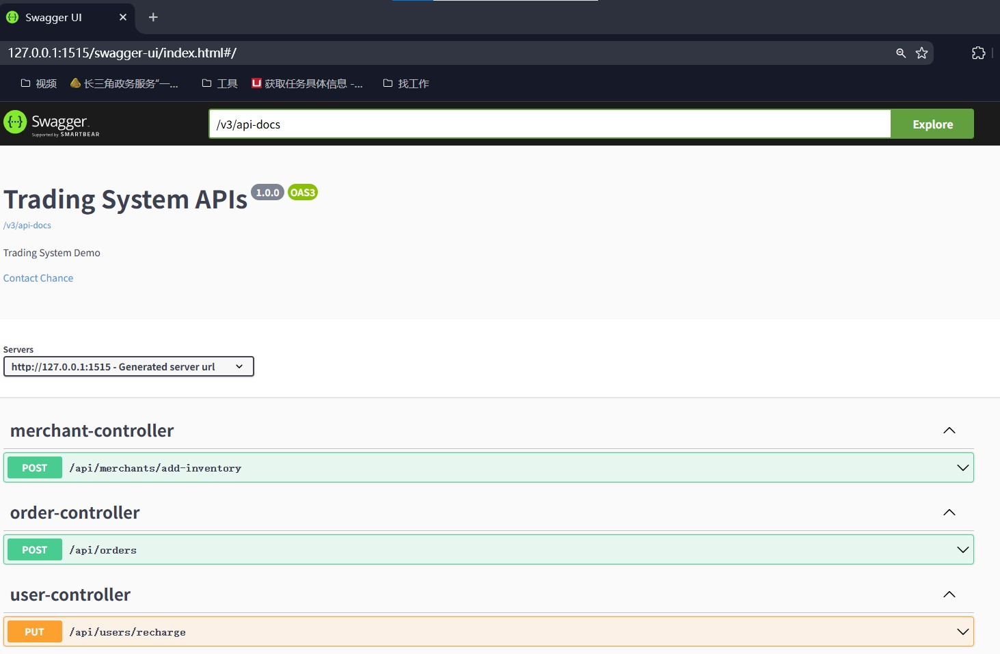

# 交易系统演示 - Java Spring Boot实现


这是一个基于Java Spring Boot的现代化交易系统演示项目，实现了完整的交易功能模块，包括订单管理、账户管理、交易执行等功能。

## 功能特性

- **多用户账户系统**：支持账户余额管理和资金操作
- **实时交易引擎**：高效执行交易策略和订单处理
- **Swagger API文档**：集成交互式API文档

## 技术栈

- **核心框架**：Spring Boot 2.7.5
- **数据持久化**：Spring Data JPA + Hibernate
- **数据库**：MySQL 5.7.29
- **API文档**：Springdoc OpenAPI 3.0
- **构建工具**：Maven
- **测试框架**：JUnit 5, Mockito, WebClientTest

## 快速开始

### 前提条件
- Java 1.8+
- MySQL 5.7+

### 本地运行
1. **克隆仓库**
```bash
git clone https://github.com/Chance2017/trading-system-demo.git
cd trading-system-demo
```
2. **初始化数据库**
```sql
source src/main/resources/init.sql
```
3. **启动服务**
```shell script
run DemoApplication
```
4. **swagger页面**

[Local Swagger Page Link](http://127.0.0.1:1515/swagger-ui/index.html)



